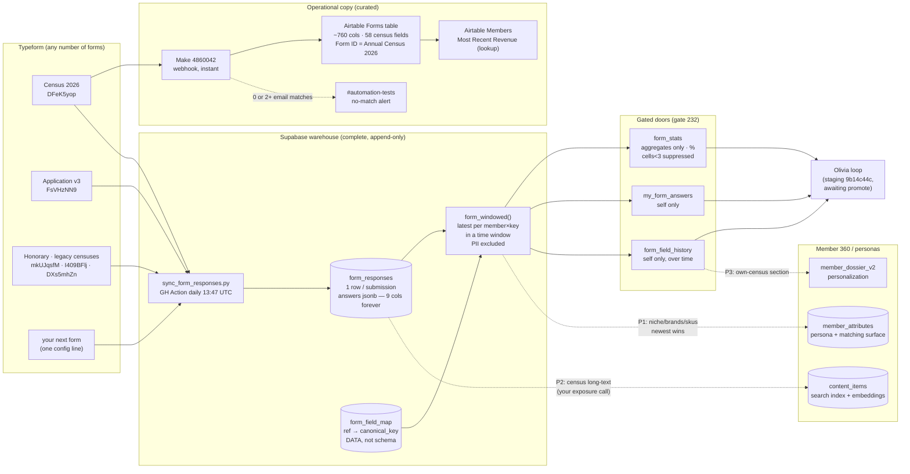

# Forms warehouse + Member 360 — ERD (2026-08-06)

Two views: the data-flow (how a submission travels) and the entity diagram (keys and joins).
Solid = live · dashed = designed, not yet built (P1–P3 persona wiring).

## 1. Data flow

## 2. Entities and keys

Notes: Airtable = curated operational copy (team + lookups); Supabase = complete raw archive +
everything machines reason over. `form_responses` is append-only — change-over-time is a read
(`form_field_history`), never an update. Exposure: raw answers owner-only; aggregates % with
small-cell suppression (whale-rule floor 3).
