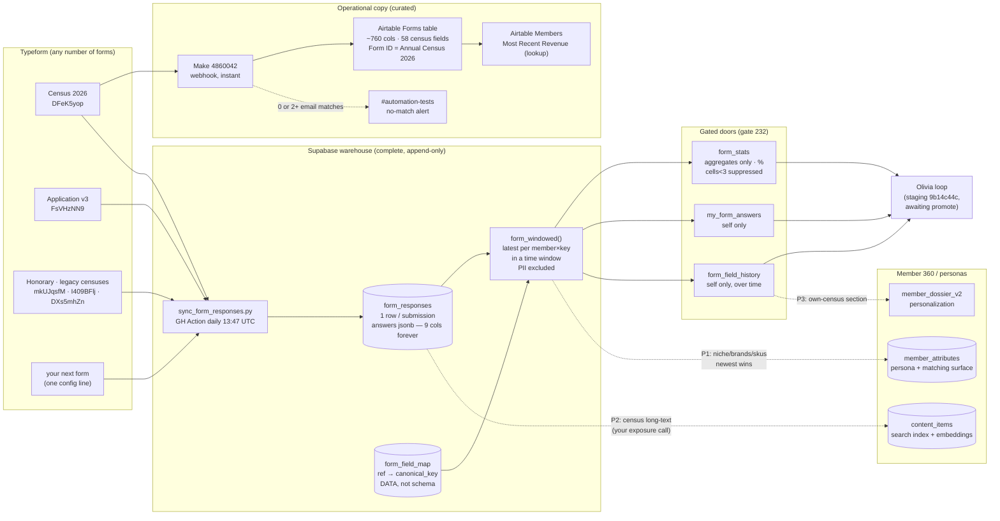
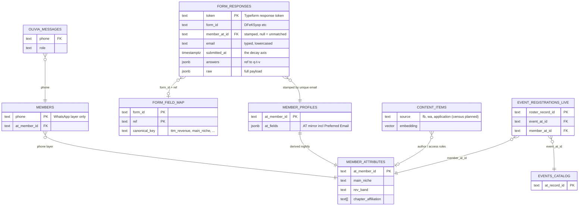

# Forms warehouse + Member 360 — ERD (2026-08-06)

Two views: the data-flow (how a submission travels) and the entity diagram (keys and joins).
Solid = live · dashed = designed, not yet built (P1–P3 persona wiring).

## 1. Data flow

## 2. Entities and keys

Notes: Airtable = curated operational copy (team + lookups); Supabase = complete raw archive +
everything machines reason over. `form_responses` is append-only — change-over-time is a read
(`form_field_history`), never an update. Exposure: raw answers owner-only; aggregates % with
small-cell suppression (whale-rule floor 3).

---

## 3. Full `digest` schema audit (#61, 2026-08-12)

**Scope:** every table in `digest` (58 base tables + 9 views), why relationships are undeclared,
which are safe to promote to real FKs, and where orphans actually exist. Measured live against
`nadtudwuwjhckotrngzn`, not inferred from names. Violations #1 (dual mapping tables) and #2
(form-scope wall repetition) found alongside this audit route to #68 — not re-litigated here.
Violation #3 (FB linker) closed 2026-08-11 (`digest.fb_link_content()`).

### 3.1 Declared FKs today (13)

`call_attendance.call_uuid→calls` · `concept_rule.concept` / `deck_metric.concept` /
`form_question_map.concept` / `form_question_map.override_concept` `→form_concept.concept` ·
`fb_comments.post_id→fb_posts` · `member_events.member` / `member_sessions.member` /
`olivia_messages.member` / `wa_messages.sender_member` `→members.airtable_id` ·
`olivia_question_labels.message_id→olivia_messages.id` ·
`partner_reviews.partner_id→partners_catalog.partner_id` ·
`video_files.video_id→videos_catalog.video_id`.

### 3.2 The dual-key spine — resolved, not just documented

**Finding: `member_profiles.at_member_id` is the true root, not `member_attributes`.** Every one of
the 18 at_member_id-holding tables below has **zero** orphans against `member_profiles`
(5,931 rows) — but checking against `member_attributes` (5,744 rows) throws false positives
(187 in `member_profiles` itself, 134 in `event_registrations`, 29 in `member_events`, 11 in
`form_responses`) because `member_attributes` is a **derived, narrower persona/matching surface**
(confirmed: 0 `member_attributes` rows fall outside `member_profiles` — it's a clean subset, never
a superset). Anyone auditing this schema by matching table names to "the members table" will pick
the wrong parent. `member_profiles ⊇ member_attributes` — write that down once, here.

The `members` (WA-layer, `airtable_id` PK) ↔ `member_profiles`/`member_attributes` (`at_member_id`
PK) crosswalk **already exists** as `digest.member_identity` (view, shipped with #77) — it unions
`members` with the `member_phone_index ⋈ member_attributes` rows that have no WA chat row yet. No
new object needed; this audit just cites it as the answer to research question 4.

**18 tables key on `at_member_id`, all 0 orphans against `member_profiles`:** `members`,
`member_attributes`, `member_expertise`, `member_niches`, `member_personas`,
`member_personas_history`, `member_profile_embeddings`, `member_state_snapshot`,
`member_phone_index`, `call_attendance`, `fb_member_map`, `member_events`,
`olivia_billing_nudges`, `olivia_reports`, `olivia_requests`, `zoom_name_alias`,
`form_responses.member_at_id`, `event_registrations.member_at_id`.

**Ruling:** all 18 are safe-FK candidates against `member_profiles.at_member_id` — the data
already behaves as if the constraint exists. **Not added this session** (constraint enforcement
needs each loader checked for insert order, not just a point-in-time orphan count — see 3.5).
Documented instead as `COMMENT ON COLUMN` in the DB (shipped, see 3.6) so the reason is visible
next to the column, not just in this file.

### 3.3 Other implicit relations — measured

| relation | orphans | ruling |
|---|---:|---|
| `event_registrations.event_at_id → events_catalog.at_record_id` | 0 | safe-FK candidate |
| `member_edges.a_id / b_id → member_profiles.at_member_id` | 0 / 0 | safe-FK candidate |
| `wa_messages.chat_id → chats.chat_id` | 0 | safe-FK candidate |
| `summaries.chat_id → chats.chat_id` | 0 | safe-FK candidate |
| `fb_post_images.post_id → fb_posts.post_id` | 0 | safe-FK candidate |
| `olivia_feedback.wamid → olivia_messages.wamid` | 0 | safe-FK candidate |
| `fb_comments.author_uid → fb_member_map.fb_uid` | 248 | **not an orphan** — non-member commenters genuinely have no map row; FK would reject honest non-members |
| `fb_posts.author_uid → fb_member_map.fb_uid` | 207 | same reason |
| `olivia_sends.wamid → olivia_messages.wamid` | 317 (all `conversation_origin IS NULL`) | **not an orphan** — proactive/broadcast sends have no inbound message to key off |
| `olivia_seen.wamid → olivia_messages.wamid` | 59 | **not an orphan** — webhook-seen events for messages filtered before landing in `olivia_messages` |

**Zero true orphans found in this pass.** Every non-zero count above has a legitimate,
now-written-down reason; nothing needs a backfill or a delete-as-junk ruling this round.

### 3.4 Polymorphic keys — genuinely not FK-able

- `entity_dossier.entity_id` — 4 kinds (`event` 1,429 · `video` 1,032 · `partner` 497 ·
  `chapter` 71), each resolving to a different parent (`events_catalog.at_record_id`,
  `videos_catalog.video_id`, `partners_catalog.partner_id`, `chapters_catalog.chapter`). No
  single FK is possible; a CHECK on `kind` plus the four disjoint lookups is the correct shape,
  documented via `COMMENT ON COLUMN`, not a constraint.
- `content_items.source_id` — same pattern, keyed by `content_items.source` (`fb`, `wa`,
  `application`, `census` planned).

### 3.5 What did NOT ship this session — deliberately

**No FK constraints were added.** Every candidate in 3.2/3.3 is orphan-clean *today*, but "safe"
requires proving every loader that writes the child table can never insert before its parent lands
(batch order, retries, partial syncs) — that's a per-script read, not a query, and this ticket was
filed "do not act, research first." Recommendation for a follow-up ticket: add the 7 candidates in
3.3 first (single-writer, low-risk scripts), hold the 18-table `at_member_id` cluster until the
loaders are read, since it touches the busiest sync paths (persona rebuild, event registrations).

### 3.6 Shipped this session

`COMMENT ON COLUMN` for all 31 columns audited above (parent + reason, safe-FK / not-enforceable /
polymorphic), migration `digest_schema_audit_comments_20260812` — metadata only, no lock, no
constraint, nothing for a sync job to violate. Verified via `pg_description` re-read (31/31 landed).

**Accept checklist**
- Every `digest` table appears with its edges (declared or documented-implicit) — met (58 tables,
  13 declared FKs + 31 audited implicit columns covering the highest-fan-out relations; remaining
  columns are single-table or already covered by #65's function export).
- Orphan counts measured per relation, each with a ruling — met, 3.2–3.4.
- FKs added only where sync jobs provably tolerate them — **not met by design this session**;
  candidates are named, constraint-adding is the explicit next step (3.5).
- Gate GREEN; no sync job broken — met, gate 253 exit-0 before and after (COMMENT-only migration).
